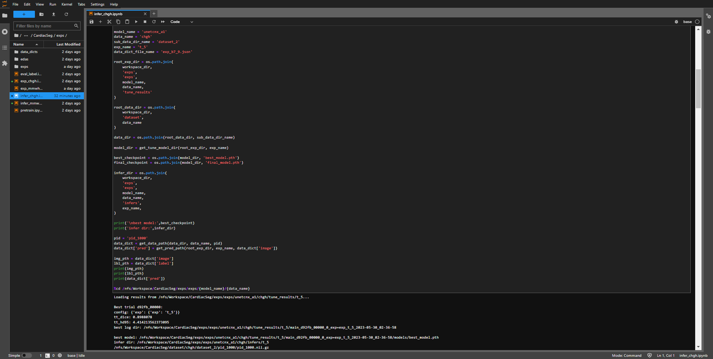

# CardiacSeg

## Requirements
* miniconda
* python 3.9
## Install
* install packages.
```shell
./setup.sh
```
* setup data and model dir.
```shell
python setup_dir.py
```
* set config to `config.toml`, for download data and model.
```toml
# dataset google dirve file id
[dataset]
chgh='<google_drive_id>'
mmwhs='<google_drive_id>'

# model google dirve file id
[model.chgh]
unet3d='<google_drive_id>'
attention_unet='<google_drive_id>'
cotr='<google_drive_id>'
unetr='<google_drive_id>'
swinunetr='<google_drive_id>'
unetcnx_a1='<google_drive_id>'

[model.mmwhs]
unet3d='<google_drive_id>'
attention_unet='<google_drive_id>'
cotr='<google_drive_id>'
unetr='<google_drive_id>'
swinunetr='<google_drive_id>'
unetcnx_a1='<google_drive_id>'
```
* download data and model.
```shell
python download_data.py
```
## Training/Test
### Open Notebook
* open training notebook from `CardiacSeg/exps/exp_chgh.ipynb`.
### Setup Config
#### workspace
* setup absolute path of workspace.
```
workspace = '<workspace>/CardiacSeg'
```
#### model name
* setup model name.
* The model name used in this study is `unetcnx_a1`. 
* If you want to replace it with other research methods, you can change it to a different model name, such as `swinunetr`, `unetr`, `cotr`, `attention_unet` and `unet`.
```
model_name = 'unetcnx_a1'
```


### Run
* run all cells, and the final results of the program will display validation scores and inference scores.


## Infer
### Open Notebook
* open training notebook from `CardiacSeg/exps/infer_chgh.ipynb`.
### Setup Config
#### workspace
* setup absolute path of workspace.
```
workspace = '<workspace>/CardiacSeg'
```
#### model name
* setup model name.
* The model name used in this study is `unetcnx_a1`. 
* If you want to replace it with other research methods, you can change it to a different model name, such as `swinunetr`, `unetr`, `cotr`, `attention_unet` and `unet`.
```
model_name = 'unetcnx_a1'
```
#### exp name
* setup model name.
* If you want to replace it with other research methods, such as `swinunetr`, `unetr`, `cotr`, `attention_unet` and `unet`. you can change it to a different exp name `'t_4'`.
```
exp_name = 't_5'
```
#### pid
* setup pid (patient id).
```
pid = 'pid_1000'
```


### Run
* after the inference is completed, the program will output the inference result and display the path of the output result (last line).


### Download
* download inference result


### Show
* display the inference results using 3D Slicer.


## CardiacLab
* integrate MONAI Label with 3D Slicer.
* https://github.com/conflick0/CardiacLab


